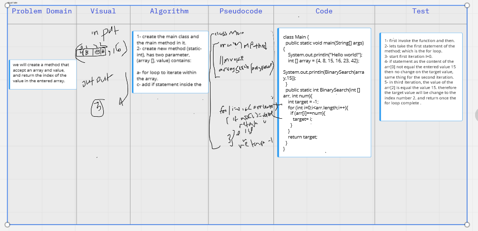

# Binary Search of Sorted Array
the aims of the problem is create a method that accept an array and value, and return the index of the value in the entered array.
## Whiteboard Process
in this challenges, we created a plan for process of thinking to solve programming issue including descripe of the problem domain, drow chart to Visualized the problem, create Algorithm, write code draft (Pseudocode), and then write the code using the programming language and teat the result.

## Approach & Efficiency
the lab learned me new think straigy.

[whiteBoard Link-include the code](codeChallenge-class03.PNG)