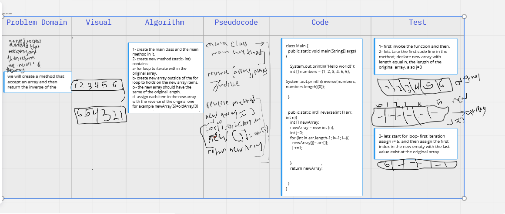

# Reverse an Array
the aims of the problem is to create method that accept an array and then return the array in reverse. 
## Whiteboard Process
in this challenges, we created a plan for process of thinking to solve programming issue including descripe of the problem domain, drow chart to Visualized the problem, create Algorithm, write code draft (Pseudocode), and then write the code using the programming language and teat the result. 
## Approach & Efficiency
the lab learned me new think straigy.  

[White Board](https://miro.com/app/board/o9J_l9Wc_5c=/)