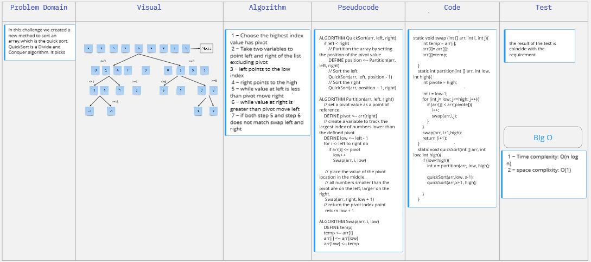

### Code Challenge 26
in this challenge we created a method that accepted an array and sorted its item from smaller to bigger 
- [WhiteBoarde Link](https://miro.com/app/board/o9J_l9Wc_5c=/)
- 

### Code Challenge 27
in this challenge we createdcreate sort merge; on which merge sort is one of the most efficient sorting algorithms. It works on the principle of Divide and Conquer. Merge sort repeatedly breaks down a list into several sublists until each sublist consists of a single element and merging those sublists in a manner that results into a sorted list.
- [WhiteBoarde Link](https://miro.com/app/board/o9J_l9Wc_5c=/)
- 

### Code Challenge 28
in this challenge we created a new method to sort an array,which is the quick sort. QuickSort is a Divide and Conquer algorithm. It picks an element as pivot and partitions the given array around the picked pivot
- [WhiteBoarde Link](https://miro.com/app/board/o9J_l9Wc_5c=/)
- 