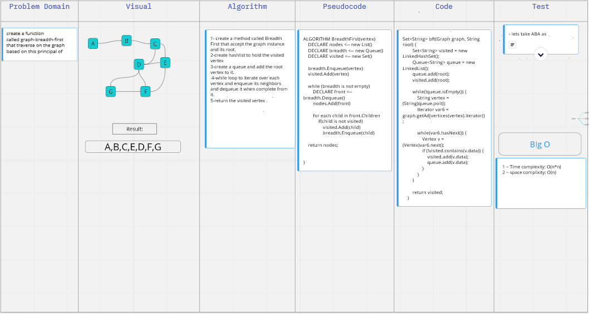
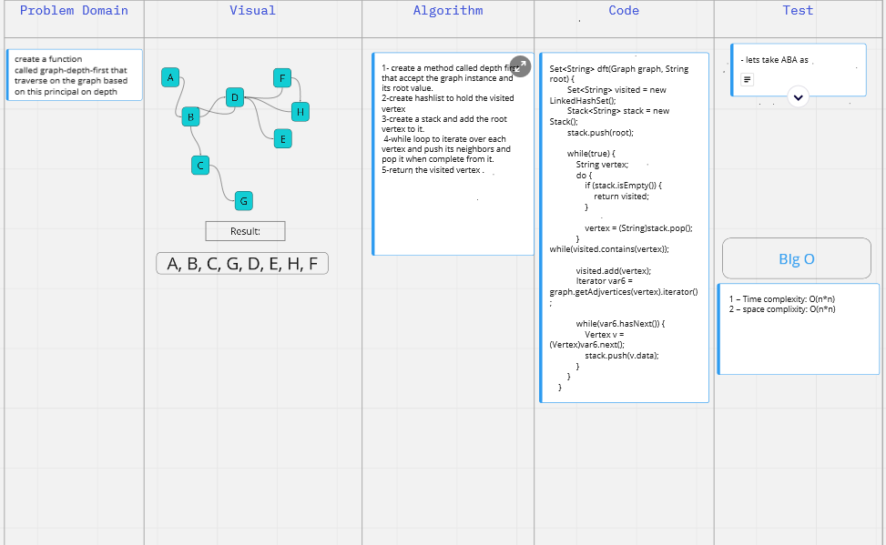

####  Referances: 
- [graph](https://www.baeldung.com/java-graphs)
### Code Challenge 36: 
in this lab we create a function called  graph-breadth-first that traverse on the graph based on this principal of breadth first
- 

### Code challenge 38: 
create a function called graph-depth-first that traverse on the graph based on this principal on depth first.
- 