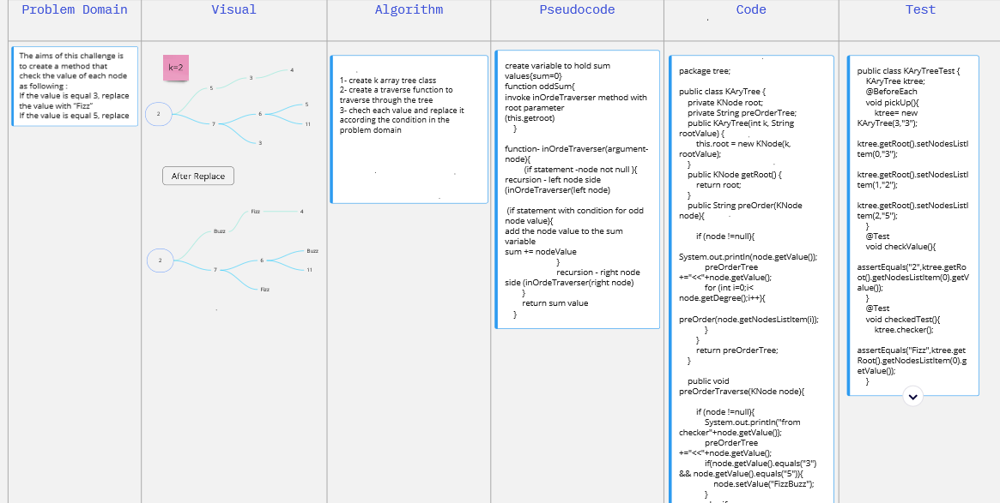

###Code Challenge: Class 15: Binary Tree and BST Implementation
In this class a new data structure created which the tress including the Binary Search Tree, and Binary Tree; the following class created as per the challenge requirements:
- Node Class: this class is for simulate the Node at the tree, which hold the node value in (value variable), plus two reference variable to the nodes located at the right and left.

- BinaryTreeClass: this class to create a comprehensive binary tress. three methods implemented for the three ways of traverse over tress using Depth First category as follows:
  - Pre-order: root >> left >> right
  -In-order: left >> root >> right
  -Post-order: left >> right >> root
- Binary Search Tree: it is a rooted binary tree whose internal nodes each store a key greater than all the keys in the node's left subtree and less than those in its right subtree.
  The following methods created to support this kind of trees as follows:
  - Add: it is accept value Arguments, and then decide the correct place to the new node based on the Binary Search Tree definition. note: a support private method (traverse) created to use inside this method.   
  - Contains: it accept value and return true if it exists at the tree.

#### Code Challenge: Class 16:
we created a new method for the binary tree class (max) that Find the maximum value stored in the tree
- for the whiteBoard exersise:
    - 
        - [Board link](https://miro.com/app/board/o9J_l9Wc_5c=/).

#### Code Challenge: Class 17:
write a method that  Return: list of all values in the tree, in the order they were encountered as shown in the diagram beside
- for the whiteBoard exersise:
    - 
        - [Board link](https://miro.com/app/board/o9J_l9Wc_5c=/).

#### Code Challenge: Class 18:
in this lab we created a class for the k array tree, which will accept once create two variable; one for the number of the max node children and the other one for the value of the 
- for the whiteBoard exersise:
    - 
        - [Board link](https://miro.com/app/board/o9J_l9Wc_5c=/).